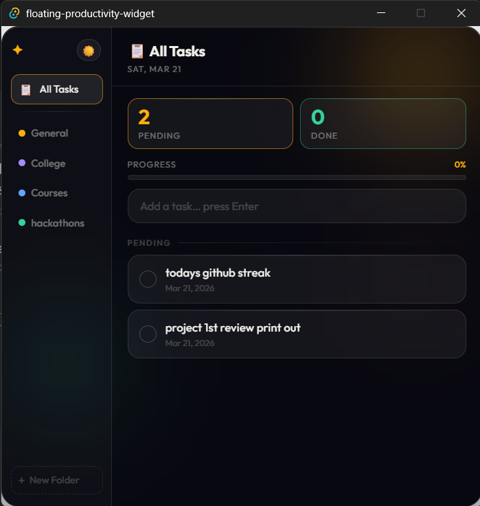

# 🪄 Floating Task Widget

A lightweight, always-on-top desktop task manager built with **Tauri + React + Node.js + MySQL**. Organize tasks into folders, track completion time, and monitor progress — all from a sleek floating widget on your desktop.

   

---

## 📸 Screenshot



---

## ✨ Features

- 🪟 Always-on-top floating widget (350×500px)
- 📁 Folder-based task organization with color labels
- ➕ Add tasks with the **Enter** key
- ✅ Complete tasks with checkbox — auto-calculates duration
- 🗂 Soft-delete — tasks are archived, never permanently deleted
- 📊 Progress bar — real-time completed/total ratio
- 💾 Persistent storage — all data in MySQL, survives app restarts
- 🕐 Smart duration display (minutes → hours → days)
- 📈 Analytics-ready — every task stored permanently with timestamps
- 🌗 Dark / Light theme toggle

---

## 🛠 Tech Stack

| Layer | Technology |
|-------|-----------|
| Frontend | React 18 + Vite 6 |
| Backend | Node.js + Express |
| Database | MySQL 8.x |
| Desktop | Tauri (Rust) — optional |

---

## 📁 Project Structure

```
Floating-Task-Widget/
├── frontend/
│   ├── components/
│   │   ├── ProgressBar.jsx
│   │   ├── Sidebar.jsx
│   │   ├── TaskInput.jsx
│   │   └── TaskList.jsx
│   ├── services/
│   │   └── api.js          # HTTP requests to backend
│   ├── App.jsx
│   ├── App.css
│   └── main.jsx
├── backend/
│   ├── db.js               # MySQL connection pool
│   ├── routes.js           # Express API routes
│   ├── server.js           # Express server entry point
│   └── taskController.js   # Task & folder CRUD logic
├── src-tauri/              # Tauri (Rust) desktop config
│   └── tauri.conf.json
├── migration.sql           # Database migrations
├── setup.sql               # Initial DB setup
├── .env.example            # Environment variable template
├── .gitignore
├── package.json
└── README.md
```

---

## ⚙️ Prerequisites

Make sure you have the following installed:

- [Node.js](https://nodejs.org/) v18 or above
- [MySQL](https://www.mysql.com/) v8 or above
- [Rust](https://www.rust-lang.org/tools/install) *(only needed for Tauri desktop build)*
- [Tauri CLI](https://tauri.app/v1/guides/getting-started/prerequisites) *(only needed for Tauri desktop build)*

---

## 🚀 Getting Started

### 1. Clone the Repository

```bash
git clone https://github.com/Eshal-Fathima/Floating-Task-Widget.git
cd Floating-Task-Widget
```

### 2. Set Up the Database

Open your **terminal** (not the MySQL shell) and run:

```bash
mysql -u root -p < setup.sql
mysql -u root -p floating_widget < migration.sql
```

Or manually in MySQL:

```sql
CREATE DATABASE IF NOT EXISTS floating_widget
  CHARACTER SET utf8mb4 COLLATE utf8mb4_unicode_ci;

USE floating_widget;

CREATE TABLE IF NOT EXISTS folders (
  id         INT PRIMARY KEY AUTO_INCREMENT,
  name       VARCHAR(100) NOT NULL,
  color      VARCHAR(20) DEFAULT '#FFAD0D',
  created_at TIMESTAMP DEFAULT CURRENT_TIMESTAMP
);

CREATE TABLE IF NOT EXISTS tasks (
  id               INT PRIMARY KEY AUTO_INCREMENT,
  title            VARCHAR(255) NOT NULL,
  category         VARCHAR(100),
  folder_id        INT,
  created_at       DATETIME DEFAULT CURRENT_TIMESTAMP,
  completed_at     DATETIME,
  status           ENUM('pending', 'completed', 'archived') DEFAULT 'pending',
  duration_minutes INT,
  FOREIGN KEY (folder_id) REFERENCES folders(id) ON DELETE SET NULL
);
```

### 3. Configure Environment Variables

```bash
cp .env.example .env
```

Edit `.env` with your MySQL credentials:

```env
DB_HOST=localhost
DB_USER=root
DB_PASSWORD=your_password
DB_NAME=floating_widget
DB_PORT=3306
PORT=3001
```

### 4. Install Dependencies

```bash
npm install
```

### 5. Start the App

**Run as a web app (development):**

```bash
npm run dev
```

This starts:
- Backend → `http://localhost:3001`
- Frontend → `http://localhost:5173`

**Run as a desktop app (requires Rust + Tauri CLI):**

```bash
npm run tauri dev
```

---

## 🗃 Database Schema

### `folders`
| Column | Type | Description |
|--------|------|-------------|
| id | INT (PK) | Auto-increment |
| name | VARCHAR | Folder name |
| color | VARCHAR | Hex color code |
| created_at | TIMESTAMP | Auto-set |

### `tasks`
| Column | Type | Description |
|--------|------|-------------|
| id | INT (PK) | Auto-increment |
| title | VARCHAR | Task title |
| category | VARCHAR | Optional category tag |
| folder_id | INT (FK) | Links to folders table |
| status | ENUM | `pending`, `completed`, `archived` |
| created_at | DATETIME | Auto-set |
| completed_at | DATETIME | Set on completion |
| duration_minutes | INT | Auto-calculated on completion |

---

## 📡 API Endpoints

### Tasks
| Method | Endpoint | Description |
|--------|----------|-------------|
| GET | `/api/tasks` | Fetch all tasks (add `?folder_id=` to filter by folder) |
| POST | `/api/tasks` | Add a new task |
| PUT | `/api/tasks/:id/complete` | Mark task as completed |
| PUT | `/api/tasks/:id/archive` | Soft-delete (archive) a task |
| GET | `/api/health` | Health check |

### Folders
| Method | Endpoint | Description |
|--------|----------|-------------|
| GET | `/api/folders` | Fetch all folders |
| POST | `/api/folders` | Create a new folder |
| DELETE | `/api/folders/:id` | Delete a folder (tasks become un-foldered, not deleted) |

---

## 🔒 Security Note

> ⚠️ **Never commit your `.env` file.** It contains database credentials.  
> The `.gitignore` is configured to exclude it.  
> Always use `.env.example` as a template for other developers.

---
